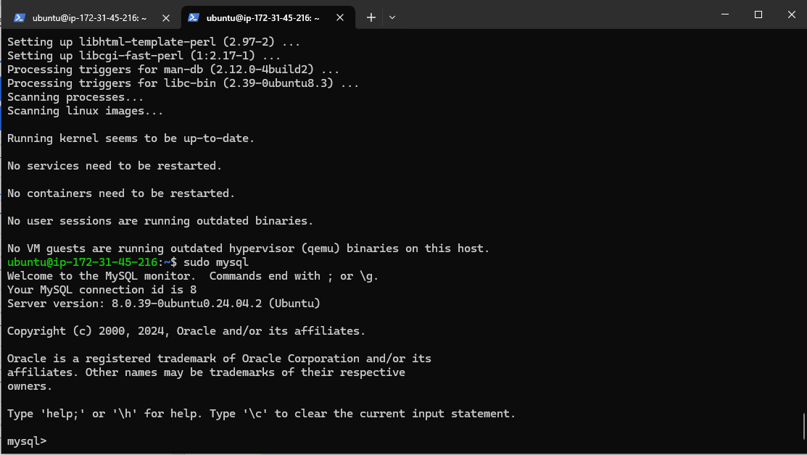

# **THE PROJECT_LEMP STACK**
____
___
>The **LEMP STACK PROJECT** combines the four different technology stackS which include: 

1. **LINUX**
1. **NGINX**
1. **MYSQL**
1. **PHP**
___

* ## **THE LINUX**
***
>  ***The web server runs on the Linux operating system. It is free and open-source and well known to be highly secure and less vulnerable to malware and viruses***
> 
***

* ## THE **NGINX**
***
> **Almost immediately, it is advisable and recommended, that **One** update and upgrade the linux setup and/or environment using the following command**
* **sudo apt update**
* **sudo apt upgrade**

> * **This tests if the web server installed is up and active, if it is up, running and active it shows in **GREEN**  color** 
> 
> * **It can be accessed locally and this confirms its local accessibility:**

> *  **This tests the web server -NGINX- on a Browser and it displays:**

___
___

* ## **THE MYSQL**
___
> The Mysql installation can be achieved through the linux command:
* * ***sudo apt install mysql-server***
* * ***sudo mysql*** to login as USER **ROOT**

> * ***There is security enabled on mysql for ROOT***
> * **This is the display of the root login after the ***security is enable using*** as shown below**
> *  * **sudo mysql_secure_installation**
> *  * **mysql -p**
> *  * **passoword does not display while it is typed**

> * *  **I log out,** then on to the next
___
___

* ## **THE PHP**
___
> * There is need for the installation of php alongside **Dependencies** using this command:

> * * **$ sudo apt install php-fpm php-mysql**

* ## **THE NGINX-PHP CONFIGURATION**
___
> **Using projectLEMP as a domain name.

On Ubuntu 20.04, Nginx has one server block enabled by default and is configured to serve documents out of a directory at /var/www/html. While this works well for a single site, it can become difficult to manage if you are hosting multiple sites. Instead of modifying /var/www/html, I create a directory structure within /var/www for my domain website, leaving /var/www/html in place as the default directory to be served if a client request does not match any other sites.

I Create the root web directory for my domain using**
> * **sudo mkdir /var/www/projectLEMP**
> 
> **I change owner of the user**

> * work on configuration which i opened using **nano editor**
> * * **link the configuration file to existing nginx configuration**
> * * tested it using:
> * * * **sudo nginx -t**

> * * **test is successful**
> * I disabled the default nginx configuration runing on port 80
> * **I reload the system**
> * **I write into the empty file what reads:**
> * * **Hello Lemp from Host**
> * **I test it on Web Browser and it displays:**

___
* ## **TESTING PHP AND NGINX WORKABILITY**
***
> **Creating a test PHP file in your document root**
> 
> * **I use the php code that returns the server- php info**
> * * **<?php
phpinfo();**
> * **I test this funtionality through the web Browser** and this is the result
> 
> * **I removed the php info for security reason**
> 
___
___
* ## **MYSQL-DATA RETRIEVAL AND PHP**
> **I access MYSQL and created a DATABASE named: **Example_database**
> **I created a **USER NAMED: USER_EXAMPLE WITH A PASSWORD FOR THE NEW DATABASE** TO LOGIN**
> 
> * **I granted this USER PERMISSION ON THE DATABASE**
> * **exit the MYSQL**
> * **LOGIN TO THE NEW USER ON MYSQL**
> * * **sudo mysql -u example_user -p**
> * * **input the user password that does not display on screen**
> * * **I display the database using** **SHOW DATABASES;**
> * 
> * **I create a table and write to it using** **INSERT INTO example_database.todo_list (content) VALUES ("My first important item");**
> * * **INSERT INTO is a mysql command and ends with ;**
> * * **I then query the database just to **SELECT INFO** from it**
> * * ** I Create a new PHP file in my custom web root directory using nano editor**
> * * * **this is the content:**<?php
$user = "example_user";
$password = "PassWord.1";
$database = "example_database";
$table = "todo_list";

try {
  $db = new PDO("mysql:host=localhost;dbname=$database", $user, $password);
  echo "<h2>TODO</h2><ol>";
  foreach($db->query("SELECT content FROM $table") as $row) {
    echo "<li>" . $row['content'] . "</li>";
  }
  echo "</ol>";
} catch (PDOException $e) {
    print "Error!: " . $e->getMessage() . " ";
    die();
}
> **FINALLY I TEST ON WEB BROWSER AND IT WORKS**

> **IT WORKS**